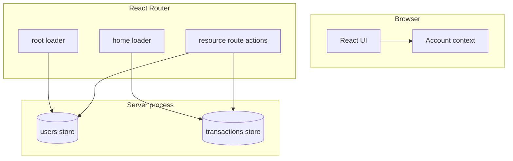

# Batch Transaction Processing System — Codebase Guide

This document describes what the application does, how it is structured, and where to find important behavior in the repository.

## Overview

**Batch Transaction Processing System (BTPS)** is a full-stack web app for viewing, filtering, and acting on **batch bank transfers**. It simulates a small workflow:

- **Makers** create batches from CSV data (multi-step wizard: details → review → summary).
- **Approvers** approve or reject **pending** batches they are assigned to.
- **Viewers** can browse data without creating or approving.

Data lives in **in-memory stores** on the server (seeded at startup). There is no external database; restarting the process resets data unless you change seeding via environment variables.

**Stack:**

| Layer     | Technology                                                                                                            |
| --------- | --------------------------------------------------------------------------------------------------------------------- |
| Framework | [React Router](https://reactrouter.com/) v7 (SSR enabled)                                                             |
| UI        | React 19, CSS Modules, [Radix UI](https://www.radix-ui.com/) primitives, [Phosphor](https://phosphoricons.com/) icons |
| Build     | Vite 8, TypeScript                                                                                                    |
| Test      | Vitest (Node environment), `app/**/*.test.ts`                                                                         |
| Quality   | ESLint, Prettier, Husky + lint-staged                                                                                 |

Path alias: `~` → `app/` (see `vite.config.ts` and `vitest.config.ts`).

**Why these choices (author notes):**

- **[Radix UI](https://www.radix-ui.com/)** — Unstyled, accessible primitives that act as building blocks. You can style and compose them to match the product without adopting a full UI framework. That keeps the surface area small and makes it realistic to grow a **custom design system** on top of your own tokens and CSS Modules.
- **[React Router](https://reactrouter.com/) v7** — Picked to **experiment** with the framework’s full-stack data APIs (loaders, actions, SSR). It has been a fun way to learn how routing, data loading, and mutations fit together in one app.

## High-level architecture

To render this diagram yourself, open **[Mermaid Live](https://mermaid.live)** in your browser, clear the editor, and paste **only** the Mermaid source from the code block below: copy from `flowchart TB` through the last line (`Actions --> Txns`). Do **not** include the surrounding triple-backtick lines or the `mermaid` language tag. The editor will render the diagram; you can export PNG or SVG from the site if needed.



1. **`root` loader** loads all users and the active user id from the server and wraps the app in `AccountProvider` (see `app/root.tsx`).
2. **`home` loader** reads URL search params, runs `runBatchTransactionsQuery`, and may **redirect** if the requested page is out of range after filtering.
3. **API routes** (`app/routes/api.*.tsx`) expose POST actions for switching user, creating a batch, approving, and rejecting. They read/write the same in-memory stores.

## Project structure

The layout is inspired by **[Bulletproof React](https://github.com/alan2207/bulletproof-react)**—feature-based folders (`features/`), shared UI primitives (`components/ui`), cross-cutting helpers (`lib/`, `hooks/`, `types/`), and clear separation of concerns—**adapted for this stack**: route modules live under `app/routes/` with React Router **loaders** and **actions** instead of a separate client-only routing layer; server-only code (`*.server.ts` under `server/`) backs those data APIs and replaces a standalone “API layer” package. There is no monorepo `apps/` split like some Bulletproof examples; a single `app/` tree holds both UI and route modules.

Repository root (conceptual; not every file listed):

```
batch-transaction-processing-system/
├── app/
│   ├── root.tsx                 # HTML shell, global loader (users + active user), layout, error boundary
│   ├── app.css                  # Global styles + design tokens import
│   ├── routes.ts                # Route table (index + API routes)
│   ├── routes/
│   │   ├── home.tsx             # Batch list page loader + BatchTransactionsPage
│   │   ├── api.set-active-user.tsx
│   │   ├── api.batch-transfer.tsx
│   │   ├── api.approve-batch.tsx
│   │   └── api.reject-batch.tsx
│   ├── components/
│   │   ├── layout/              # e.g. app top bar
│   │   └── ui/                  # Reusable primitives (button, dialog, table, …) + CSS modules
│   ├── features/
│   │   └── batch-transactions/
│   │       ├── batch-transaction-list/   # Table, toolbar, filters, dialogs, pagination
│   │       ├── create-batch-transfer/    # Wizard steps + dialog + context
│   │       └── utils/                    # CSV parsing, filters ↔ URL, validation copy
│   ├── server/                  # Server-only modules (*.server.ts)
│   │   ├── users-store.server.ts
│   │   ├── batch-transactions-store.server.ts
│   │   ├── query-batch-transactions.server.ts
│   │   └── parse-create-batch-payload.server.ts
│   ├── state/
│   │   └── account-context.tsx  # Selected user synced with root loader / API
│   ├── hooks/                   # debounce, popup, persist active user, etc.
│   ├── lib/                     # api-errors, format, user-role helpers, utils
│   ├── types/                   # transaction.ts, user.ts
│   ├── config/                  # env (client/server), constants
│   └── styles/
│       └── tokens.css           # CSS variables / theme tokens
├── eslint.config.js
├── vitest.config.ts
├── vite.config.ts
├── react-router.config.ts       # SSR: true
└── package.json
```

### Route map

| Path                   | Module                    | Role                                   |
| ---------------------- | ------------------------- | -------------------------------------- |
| `/`                    | `routes/home.tsx`         | List batches; filters in query string  |
| `/api/set-active-user` | `api.set-active-user.tsx` | POST: set server-side active user      |
| `/api/batch-transfer`  | `api.batch-transfer.tsx`  | POST: create batch from wizard payload |
| `/api/approve-batch`   | `api.approve-batch.tsx`   | POST: approver settles a transaction   |
| `/api/reject-batch`    | `api.reject-batch.tsx`    | POST: approver rejects a transaction   |

Routes are registered in `app/routes.ts`.

## Domain model

### Users (`app/types/user.ts`)

- Roles: **Approver**, **Maker**, **Viewer** (a user may have multiple roles).
- Seeded users include at least one of each role; additional users are random combinations.

### Batch transactions (`app/types/transaction.ts`)

- Each row is one **transaction line** inside a batch (same `batchId` / `batchName` for rows created together).
- **Status:** `settled` | `pending` | `failed`.
- **Approver** is stored per row (`userId` + display name). Approve/reject APIs enforce that the **active user** is the assigned approver.

## Server-side data

### Users store (`app/server/users-store.server.ts`)

- In-memory `Map` of users.
- **`activeUserId`**: which user the server considers “logged in” for API authorization and for the root loader. Persisted only in memory for the lifetime of the process.
- `setActiveUserId` validates the id exists.

### Transactions store (`app/server/batch-transactions-store.server.ts`)

- In-memory `Map` of transactions by id.
- **Startup seed:** Faker-generated rows; count configurable (see [Environment](#environment)).
- **Create batch:** `createRowsFromBatchTransfer` validates rows (unless saving as `failed`), assigns a shared `batchId`, and writes all lines to the store.

### Query layer (`app/server/query-batch-transactions.server.ts`)

- `runBatchTransactionsQuery(allRows, filters, dateOrder)` applies:
  - text search across batch name, account, holder, approver, batch id,
  - optional date range and status,
  - sort by transaction date,
  - pagination.

Filters and pagination are driven by URL search params parsed in `app/features/batch-transactions/utils/filter-search-params.ts`.

## Authorization (simplified)

Implemented in `app/lib/user-role.ts` and checked in API actions:

| Action                               | Requirement                                                    |
| ------------------------------------ | -------------------------------------------------------------- |
| Create batch (`/api/batch-transfer`) | Active user has **Maker**                                      |
| Approve / reject                     | Active user has **Approver** and matches `row.approver.userId` |

There is no real authentication; switching the user in the UI updates server state via `/api/set-active-user`.

## Feature flows

### Batch list

- **Toolbar:** search (debounced), status filter, date range, date sort — state is reflected in the URL for shareable/bookmarkable views.
- **Table:** virtualized list, row actions (details, approve/reject where applicable).
- **Dialogs:** transaction details, action result feedback.

### Create batch (Maker)

- **Step 1:** Batch name, approver pick, CSV upload.
- **Step 2:** Parsed rows with validation; invalid rows can still be submitted as a **failed** batch.
- **Step 3:** Summary; submit posts to `/api/batch-transfer`.

CSV parsing and validation: `app/features/batch-transactions/utils/batch-transfer-csv.ts` and `batch-transfer-validation-messages.ts`.

## Environment

Server-only keys (`app/config/env.server.ts`):

| Variable                 | Meaning                                                                                           |
| ------------------------ | ------------------------------------------------------------------------------------------------- |
| `BTPS_SEED_USERS`        | Number of seeded users (default **5**; minimum structure still includes Viewer, Approver, Maker). |
| `BTPS_SEED_TRANSACTIONS` | Number of seeded transactions (default **65**).                                                   |

Client-side: `app/config/env.ts` exposes e.g. `isDev` from Vite (`import.meta.env`).

## Development commands

| Command                                   | Purpose                      |
| ----------------------------------------- | ---------------------------- |
| `npm run dev`                             | Dev server with HMR          |
| `npm run build`                           | Production build             |
| `npm start`                               | Serve production build       |
| `npm run typecheck`                       | React Router typegen + `tsc` |
| `npm test`                                | Vitest once                  |
| `npm run test:watch`                      | Vitest watch mode            |
| `npm run lint` / `npm run lint:fix`       | ESLint                       |
| `npm run format` / `npm run format:check` | Prettier                     |

## Testing

- **Vitest** is configured with `~` → `app` and Node environment.
- Tests live next to code as `*.test.ts` (e.g. `app/lib/format.test.ts`, `app/features/batch-transactions/utils/batch-transfer-csv.test.ts`).

## Conventions

- **`*.server.ts`**: import only from server contexts (loaders, actions); holds stores and parsing that must not leak to the client bundle incorrectly.
- **CSS Modules** paired with components (`*.module.css`).
- **Types** centralized under `app/types/` for shared domain shapes.

## AI usage

This project used AI assistance in the following ways:

1. **Seed data** — AI was used to help design and generate the seeding logic and fake data patterns for users and batch transactions (implemented with [Faker](https://fakerjs.dev/) in `app/server/users-store.server.ts` and `app/server/batch-transactions-store.server.ts`).
2. **Documentation** — AI was used to help author and structure project documentation (for example `docs/CODEBASE.md` and updates to `README.md`).
3. **Patient study buddy** — The friend who doesn’t get tired of my questions. I can ask the same doubt in five different shapes, at any hour, and still get a straight answer—trade-offs, React Router details, and a calm “here’s another way to look at it.” Not a replacement for my own judgment. Just a sounding board with unlimited patience and no need for sleep.

## Limitations (by design)

- No database or multi-instance consistency; use a real persistence layer if you deploy multiple nodes.
- Active user is a demo stand-in for auth sessions.

For install and build commands, see the repository `README.md`.
